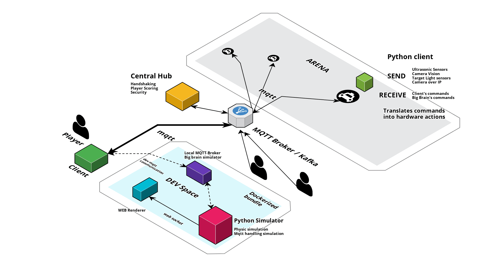

# Robosnipers Deathmatch

This is all the software needed for the Robosnipers Deathmath IoT hackaton that will be held by [Interlogica](https://www.interlogica.it).

## Index

- [Component Overview](#overview)
    - [Robot Client](#robotclient)
    - [Mqtt Broker](#mqttbroker) 
    - [Big Brain](#bigbrain)
    - [Player Client](#playerclient)
    - [Test Simulator](#testsimulator)
        - [Local MQTT Broker](#localmqttbroker)
        - [World Simulator](#worldsimulator)
        - [Web Renderer](#webrenderer)
- [MQTT Protocol](#mqttprotocol)
- [Development](#development)

<a name="overview"></a>
## Component Overview

Here's a visual overview of all the software components needed for the event to run properly



[Cloudcraft Link to clone and change the schema](https://cloudcraft.co/view/5d17f23a-dddb-47f4-b2a7-06dde11f85de?key=3m40jn0enpfd2t90)

<a name="robotclient"></a>
### Robot Client
A python program will be deployed on every piece of hardware (Raspberry 3B+?) we will use. It will have the following responsabilities

#### MQTT Communication
It will be in charge of receiving commands from the central MQTT broker and sending raw sensor data via MQTT. For the protocol used, see the [MQTT protocol](#mqttprotocol) section

#### Camera view and Image Reckognition
It will run an OpenCV or ML script. It will be trained to reckognize the target on the video stream acquired by the camera installed on the robot and, in case it finds it, to send the coordinates and the lenght/width of the square where the target is. 

#### Hardware communication and action
The robot vendor (Freenove) gives access to an easy to use SDK ready to be imported in a python codebase. It will help us communicating from and to the hardware sensors

<a name="mqttbroker"></a>
### MQTT Broker

The MQTT broker is the central gateway for all the information from and to the robots and the players' clients. 

A first (and naive) implementation could be just a mosquitto broker but we will need something more configurable for security reasons (avoid players to send malicious commands to other robots) and to handle a proper handshaking. Maybe Kafka?

<a name="bigbrain"></a>
### Big Brain

This part will be always listening to everything happening during the match and will be responsible to keep tracking of the score and cosmetic effects: let's suppose we want to add sound or visual effects, this wil be the key component to do that. Moreover, maybe this is where the handshaking and the robot enrolling should happen.

<a name="playerclient"></a>
### Player Client

The players (teams actually) should build this one: it should implement the MQTT communication and robots AI.

We should provide some kind of bot to train the players AI, which should work in the same way as a player's program would. This is also a way to test our full implementation.

Since there's no language dependency, we should provide the players some boilerplate code in as many languages as we can.

A simple implementation could be found in ```bot``` folder

<a name="testsimulator"></a>
### Test Simulator

Building an AI agent that speaks to a remote robot via MQTT isn't an easy task. I think the players/teams partecipatig should be able to train themselves before the event, hence the need of a simulator. 

The ideal way to distribute this simulatori is via a docker compose file. We should probably configure and upload some image on the Interlogica docker registry.

Anyway, a viable piece of software should have the following components

<a name="localmqttbroker"></a>
#### Local MQTT Broker / BIG Brain
We should emulate the MQTT broker on localhost. We also probably need to simulate the big brain, but it depends on what we want to add to it.

<a name="worldsimulator"></a>
#### World Simulator / Brain
This may be the hardest part. This is written in python and will be referred by the name of "brain". The source code is in the ```brain``` folder.

First of all it should be a physic simulation: we sould handle collisions and raycasting, so we can simulate the robots driving around and shooting themselves. Of course it could not be a perfect one, but we'll try to get as close as possible. 

It should also emulate the robots clients with their MQTT communication protocols, so the agents on the simulation could respond correctly to the commands that arrive from the mqtt broker.

Finally, it should send the data via WebSocket to some kind of renderer, which we decided to be a web page. If you have any kind of experience with multiplayer games, we could say this is the main server, the single source of truth. We will not have lag problems on a LAN, so it will be easier to implement (no delta time or prediction tricks), but the mechanics will be the same; we will have to build up a protocol of communication via WebSockets that sends to the client all the needed informations in the most optimized way possible.


<a name="webrenderer"></a>
#### Web Renderer 
A web page that has the role of rendering what's happening in the simulated world. With this component, the sky is the limit...

An easy implementation could be made with [p5.js](https://p5js.org), the easiest graphic library I've used. It should render the main map (loaded from a JSON file in GEOJson format) and listen to the WebSocket for the world updates.

<a name="mqttprotocol"></a>
## MQTT protocol

Here is proposal for the topic namespace to be used to communicate to and from the robot

### Control topics

The following section will provide a list of topics to be used as control topics for enrolling and handshaking

```
# add your bot to the world
subscribe/BOT_ID {empty payload} 
```

### Sensors topics

The following topics will be sent to the broker by the robots

```
# proximity sensors readings in cm
sensors/BOT_ID/proximity {front_left}|{front_right}|{rear}
```

### Command topics

The following topics are to be used to send commands from the player's client to the robot

```
# move your bot forward
command/BOT_ID/move {empty payload} 
```
```
# move your bot downward
command/BOT_ID/rear {empty payload} 
```
```
# turn your bot
command/BOT_ID/turn {"left" or "right"}
```
```
# stops bot engine
command/BOT_ID/stop {empty payload} 
```

<a name="development"></a>
## Development

To start developing this app you need python3 and docker installed. I suggest to use a Linux machine, many of the things here have never been tested on Windows (and maybe never will).

First of all, you need an MQTT broker running to run the application.

To start the MQTT broker, from project root directory launch
```
docker-compose up
```

### Brain

To start developing what we called brain (server + simulation):
```
cd brain
```
then create and setup the virtual env with:
```
virtualenv venv
pip3 install -r requirements.txt
```

> NOTE: if you don't have virtualenv installed, you can install it with
```
pip3 install virtualenv
```

to start the application, run
```
python3 main.py
```
This script supports the following command line arguments:
- -h, --help prints the help
- --debug shows a window with pygame running to check if the world is rendering correctly 

### Web view

To run both the web view and the map editor, you need to run a web server on the ```assets``` folder. There are many ways to do that, maybe the easiest one is the following python one-liner.
```
cd assets
python -m SimpleHTTPServer
```
or (for python3)
```
python3 -m http.server
```

At ```http://localhost:8000``` you'll find the simulator front end running


#### Map editor
Assuming you used the previous command to launch the web server, you can find the map editor at
```http://localhost:8000/map_editor/editor.html```
